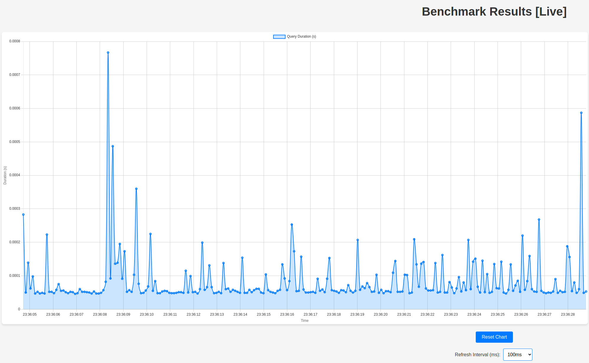

# pgbenchmark

`pgbenchmark` is a Python package to benchmark query performance on a PostgreSQL database. It allows you to measure the
execution time of queries over multiple runs, providing detailed metrics about each run's performance.

## ⚠️ This library is under HEAVY development ⚠️ <br> I'll try to keep everything backwards compatible...

---

## Installation

```shell
pip install pgbenchmark
```

---

# Example

```python
import psycopg2
from pgbenchmark import Benchmark

conn = psycopg2.connect(
    "<< YOUR CONNECTION >>"
)

benchmark = Benchmark(db_connection=conn, number_of_runs=1000)
benchmark.set_sql("./test.sql")

for result in benchmark:
    # {'run': X, 'sent_at': <DATETIME WITH MS>, 'duration': '0.000064'}
    pass

""" View Summary """
print(benchmark.get_execution_results())
# {'runs': 1000, 'min_time': '0.00005', 'max_time': '0.000287', 'avg_time': '0.000072'}
```

#### You can also pass raw SQL as a String, instead of file

```python
benchmark.set_sql("SELECT 1;")
```

#### It also supports SQLAlchemy connection engine

```python
engine = create_engine("postgresql+psycopg2://.......")
conn = engine.connect()

# Set up benchmark class
benchmark = Benchmark(db_connection=conn, number_of_runs=5)
```

---

# Example with CLI

`pgbenchmark` Support CLI for easier and faster usages. If you need to check one quick SQL statement(s) without
boilerplate and Messing around in code, simply install the library and run:

```shell
pgbenchmark --sql "SELECT 1;" --runs=1_000_000
```

### If your benchmark runs long enough, you can view live visualization

### Add `--visualize=True` flag

```shell
pgbenchmark --sql "SELECT 1;" --runs=1_000_000 --visualize=True
```

After running pgbenchmark, go
to <a href="http://127.0.0.1:4761" class="external-link" target="_blank">http://127.0.0.1:4761</a>.



It is live enough for you to have fun. You can choose between `100ms` and `5000ms` refresh intervals.
